# Saple Bridge Improvement Plan

Based on the 30-agent audit completed on 2026-08-24 against commit `5f800e7e28fd`.

## Goal

Make Saple Bridge safe against destructive paths, unapproved command execution, stale review decisions, corrupt-state loss, and process leaks before expanding the product. Later phases deepen the highest-leverage modules, improve accessibility and responsiveness, then add product features.

## Governing decisions

- Safety and data-integrity work blocks feature development.
- Privileged Rust commands operate only on native-dialog-approved project roots.
- Agent-authored shell commands require explicit human approval before first execution.
- Corrupt or unreadable state fails closed; it is never treated as empty state.
- Review feedback travels through persisted records, never by typing prose into a shell.
- Existing `fs_lock`, `writeQueue`, notification, confirmation, and store patterns are reused before introducing new abstractions.
- Each phase must leave its smallest relevant automated check behind.

## Sequence

```mermaid
flowchart LR
  P0[Phase 0<br/>Emergency safeguards] --> P1[Phase 1<br/>Trust boundaries]
  P1 --> P2[Phase 2<br/>State integrity]
  P2 --> P3[Phase 3<br/>Review and swarm correctness]
  P3 --> P4[Phase 4<br/>Operations and release]
  P4 --> P5[Phase 5<br/>Architecture deepening]
  P5 --> P6[Phase 6<br/>Frontend and accessibility]
  P6 --> P7[Phase 7<br/>Performance]
  P7 --> P8[Phase 8<br/>Product expansion]
  P8 --> P9[Phase 9<br/>Documentation and maintenance]
```

---

## Phase 0 — Emergency safeguards

**Outcome:** Remove the verified paths to workspace deletion, silent shell execution, and immediate user-data destruction.

### Work

- Reject destructive targets equal to the canonical project root.
  - Cover `file_path = "."` and `file_path = ""` in `delete_path_inner`.
  - Keep deletion of legitimate contained children unchanged.
  - Files: `src-tauri/src/project.rs`, `src-tauri/src/files.rs`.
- Require confirmation for every distinct swarm acceptance command before first execution.
  - Display the full command, cwd, source, and timeout.
  - Store approval against a command hash for the current swarm run only.
  - Do not permanently trust a command across projects or runs.
  - Files: `src/stores/swarmStore.ts`, swarm UI, `src-tauri/src/swarm.rs`.
- Remove review-note delivery through `write_pty`.
  - Keep notes in review/session/run records already written by the backend.
  - Let the agent resume through a structured state transition or explicit operator action.
  - File: `src/components/review/ReviewWorkspace.tsx`.
- Block generic writers from `.git/**`.
  - Apply the rule in the shared contained-path policy used by generic file writes.
  - Do not block Git commands implemented intentionally in `git.rs`.
- Abort memory restore if the pre-restore safety snapshot fails.
  - Never delete live memory until a valid backup exists.
  - File: `src-tauri/src/memory.rs`.

### Checks

- Rust regression test: deleting `.` and `""` returns an error and leaves the workspace intact.
- Rust regression test: generic writes into `.git/hooks` and `.git/config` are rejected.
- Frontend test: unapproved acceptance commands never invoke `run_acceptance_command`.
- Frontend test: rejection notes containing ``$()``, backticks, `&&`, and control characters never reach `write_pty`.
- Rust test: failed backup leaves live memory untouched.

### Exit criteria

- No destructive command accepts the project root.
- No agent-authored command runs without a visible approval.
- No human prose is injected into a live shell.
- All Phase 0 regression tests pass on Windows and macOS CI.

---

## Phase 1 — Privileged-command trust boundaries

**Outcome:** A compromised or buggy renderer cannot select arbitrary filesystem or execution roots.

### Work

- Add a Rust-managed registry of approved project roots.
  - Populate it only after native directory selection or validated restoration of a previously approved project.
  - Store canonical roots, not renderer strings.
  - Close/remove roots when workspaces are removed.
- Validate `project_path` for every privileged command:
  - files, project configuration, memory, Git, review, swarm, diagnostics, watchers, control-plane records, and shell execution.
- Validate PTY `cwd` against the registry.
  - Preserve explicitly supported home-shell behavior as a separate, intentional mode.
- Replace free-form renderer PTY environment overrides.
  - Deny `PATH`, `NODE_OPTIONS`, `PYTHONSTARTUP`, `PSModulePath`, loader variables, and similar execution-affecting keys.
  - Prefer Rust-constructed provider environment variables.
- Restrict embedded-browser navigation to `http` and `https`.
- Replace fixed-port WebView CDP exposure.
  - Prefer a debugging pipe.
  - If a port remains necessary, randomize it and show a persistent “browser automation active” indicator.
- Harden June control.
  - Remove stale discovery records at startup.
  - Protect the discovery file with OS ACLs or replace HTTP plus bearer token with a user-scoped named pipe.
  - Compare secrets in constant time and limit concurrent requests.
  - Scope terminal-writing actions to permitted panes.

### Checks

- Table-driven Rust tests covering every registered privileged command and an unregistered root.
- PTY tests for dangerous environment keys.
- Browser URL-scheme tests.
- June concurrency/auth tests, including duplicate request IDs.

### Exit criteria

- Passing an arbitrary absolute directory from the renderer cannot read, write, delete, watch, or execute there.
- Browser automation and June expose no unauthenticated fixed local control port.

---

## Phase 2 — State integrity and recovery

**Outcome:** Corruption, transient reads, concurrent writers, and Windows filesystem behavior cannot silently erase state.

### Work

- Introduce explicit state-load outcomes: `missing`, `loaded`, `corrupt`, `locked`, and `io_error`.
  - Apply first to swarm state, tasks, review records, sessions, and memory configuration.
  - On corruption, preserve the original bytes and block writes until the user chooses recovery.
- Add recovery UI.
  - Show the affected path and error.
  - Offer retry, reveal file, save corrupt copy, restore backup, or explicitly start empty.
- Replace boolean store loading guards with per-project request-sequence tokens.
  - Apply to project, Kanban, memory, session, and swarm loads.
  - Commit only the latest request for the active project.
- Serialize watcher reloads behind pending writes using the existing queue key.
- Lock every read-modify-write across the full operation.
  - Review records, tasks, sessions, runs, memory saves/restores, and control-plane mutations.
- Make memory snapshots transactional.
  - Copy to a temporary sibling.
  - Validate the copy.
  - Atomically swap only after success.
  - Refuse overwrite unless explicitly confirmed.
- Make cross-process locking fail safely.
  - Do not silently proceed unlocked.
  - Avoid stealing a lock only because it is older than 15 seconds.
  - Use PID liveness/heartbeat or real advisory locks.
- Centralize JSON text reading.
  - Strip UTF-8 BOM consistently.
  - Report unsupported UTF-16 clearly.
- Retry Windows rename failures with short bounded backoff.
- Add `.saple/` to each repository’s `.git/info/exclude` after disclosure.

### Checks

- Corrupt swarm/task/review JSON cannot be overwritten by subsequent actions.
- Rapid project switching never commits an earlier project load into the current project.
- External edit plus queued save preserves a deterministic winner and never merges unrelated project state.
- Snapshot failure tests cover permissions, locked files, and partial copies.
- Windows rename retry test uses an injectable rename function or deterministic failure hook.

### Exit criteria

- Every persisted store distinguishes missing from unreadable/corrupt.
- Recovery actions are visible and reversible.
- No state writer performs an unlocked read-modify-write.

---

## Progress log

Updated at phase boundaries; completed implementation detail lives in git history, not here.

| Phase | Status | Evidence |
| --- | --- | --- |
| 0 - Emergency safeguards | Complete | destructive-root rejection, acceptance approval gate, review prose never reaches `write_pty`, `.git/**` writer block, backup-gated memory restore |
| 1 - Privileged-command trust boundaries | Complete | approved-root registry, per-command `project_path` validation, PTY cwd/env hardening, browser scheme and June fixes |
| 2 - State integrity and recovery | Complete | structured load outcomes, recovery UI, request-sequence tokens, locked read-modify-writes, transactional snapshots, BOM handling, `.saple/` exclude disclosure |
| 3 - Review, swarm, and process correctness | **Complete (code)** | all work items and automated checks landed; two environment-dependent QA/CI runs deferred into Phase 4 - see Phase 3 status |
| 7 - Performance and scale | Complete | hidden-room suspension (terminal polling/WebGL, swarm tails/timers), narrow store selectors, stabilized card callbacks, coalesced swarm saves, mtime-keyed memory parse cache with conventional-path fast path, path-indexed git status with capped untracked enrichment, branch-from-HEAD, bounded concurrent diagnostics probes |
| 4 - Observability, testing, and release hardening | **Complete (code)** | durable app log + privileged-action audit log, diagnostics report, failure escalation/dedupe, IPC contract registry tests, coverage baseline, sidecar pinning, SHA-pinned Actions, Dependabot/audit job, release gate; signing/notarization and maintainer-side pins deferred - see Phase 4 status |
| 5 - Architecture deepening | Complete | single-owner path policy with coded errors, terminal transport/bridge inversion, coordinator-link and crash-recovery extraction from swarmStore, provider facts table (Rust + renderer), memory layout owner, sidecar module split, coded IPC error surfaces - see Phase 5 notes |
| 6 - Frontend, UX, and accessibility | Complete | error banners with retry, cold-start path validation with relocate/remove, memory-first dashboard counts plus external-edit watching, per-recent-project removal, reopenable onboarding with provider readiness, quit confirmation for live agents, theme aliases + tokenized overlays + restored text selection + type scale + narrow-window responsive pass, keyboard/screen-reader accessibility incl. xterm SR mode and AA muted contrast - see Phase 6 notes |
| 8 - Product expansion | Complete (code) | git fetch/pull/push with ahead/behind sync bar, hidden-ref per-run checkpoints with diff and confirm-gated restore, agent activity dashboard, typed MCP tools (`get_tasks`, `update_task_status`, `send_mailbox_message`) in the sibling saple-mcp repo, prompt library across terminal/Kanban/swarm, ranked local memory search, read-only cross-project task summaries on recents - each slice ships with its own automated check; saple-mcp commits are local and unpushed |
| 9 - Documentation and maintenance | **Complete** | corrected README storage tree and snapshot layout, full Rust module map, first-run/troubleshooting/security-and-privacy docs, archived root-level planning docs, missing-sidecar setup error pointer, Node `>=20.19` engine pin, `npm run verify` sequence matching CI - see Phase 9 status |

---
## Phase 4 - Observability, testing, and release hardening

**Outcome:** Production failures are diagnosable, destructive paths are tested, and release inputs are reproducible.

### Status (updated at the end of the Phase 4 session)

All three work areas landed on branch `traycer/saple-bridge-soft-salmon`:

1. `feat(logging)` / `feat(audit)` - durable size-capped app log under the OS app log dir with secret redaction; append-only JSONL privileged-action audit log (source, command, cwd, exit code/error, duration) wired into shell runs, PTY spawn, `delete_path`, and `write_pty` failures; renderer errors forwarded into the durable log via `log_renderer_error` with Rust-side redaction.
2. `feat(diagnostics)` / `feat(notifications)` - `collect_diagnostics` command plus a Settings "Copy diagnostics report" action (redacted); repeated failures for state saves, control-plane writes, watchers, PTY launch, and swarm launch escalate to persistent notifications after repeats; duplicate toasts dedupe while persistent root-cause errors never go silent.
3. Testing - a frontend-to-Rust command registry (`src/lib/ipcCommands.ts`) enforced by two-sided contract tests (TS AST scan of every `invoke()` call site vs the Rust `generate_handler!` list); expanded destructive-path tests (traversal, dot/case/trailing-separator variants), atomic-write failure tests, snapshot round-trip test; frontend coverage baseline published via `test:coverage` (statements ~66%, branches ~64%; no thresholds yet).
4. `chore(release)` / `ci:` - sidecar checkout pinned to a reviewed SHA and built with `cargo --locked`, sidecar SHA-256 recorded per build; GitHub Actions pinned to full commit SHAs; e2e lockfile committed with `npm ci` everywhere; Dependabot (npm, cargo, actions) plus an advisory-audit CI job failing on high/critical; release workflow gained a concurrency group and an approval environment; local QA builds no longer mutate version files.

Deliberate CSP deviation: production `connect-src`/`frame-src` keep loopback-host entries because P5 Local Preview (shipped feature, validated by `src/lib/loopback.ts`) requires them; these are loopback-scoped port wildcards, not arbitrary-origin wildcards. Removing them is a product decision to drop or dev-gate Local Preview.

Deferred to their natural owners (environment/maintainer-dependent):

- [ ] Windows installer signing and macOS notarization/signing (requires certificates).
- [ ] Maintainer actions: record `SAPLE_MCP_PINNED_SHA` in `scripts/prepare-sidecar.mjs` and the `SAPLE_MCP_SHA` repository variable; create the `release` GitHub environment with required reviewers (the approval gate is inert until then).
- [ ] Run the Unix-side process-group kill test on macOS CI and the packaged-app Windows QA pass carried over from Phase 3.
- [ ] Modest coverage thresholds once the baseline has visibility; delete_path `.git/**` parity with generic writers flagged as a follow-up.

---
## Phase 3 - Review, swarm, and process correctness

**Outcome:** Reviews certify exact evidence, swarms recover from lifecycle races, and stopped processes actually stop.

### Status (updated at the end of the first Phase 3 session)

All three work areas landed on branch `traycer/saple-bridge-soft-salmon` in four commits:

1. `feat(review)` - tree-evidence binding, stale-approval refusal, structured corrupt loads, scoped commits, diff-cache invalidation by tree identity, verification-command edit guard.
2. `feat(swarm)` - exactly-once digest delivery via persisted `pendingDigests`, digest log/prompt caps plus worker-text sanitization, pre/post launch race guards, `removeAgent` graph repair, scheduler-deadlock detection, configurable hung-agent alerts.
3. `feat(process)` - concurrent pipe drains in `run_shell_with_timeout` (fixes false timeouts on verbose output), whole-tree kill on timeout/cancel via the shared `proc_tree` module (Job Objects / process groups), per-run cancel tokens with UI cancel controls for verification and acceptance, `write_pty` input-pressure reporting, terminal spawn tombstones, PTY listener startup unwinding.
4. `refactor(swarm)` - Enter-drop retry semantics for digest injection, hung-watch persistence guard, documented kill-on-close behavior.

Automated checks that now exist: approval fails after any reviewed-tree change; corrupt review records are preserved, flagged, and never recreated over; commits refuse unexpected staged files and scope to the reviewed path set; tree identity is stable when unchanged and sensitive to HEAD/status changes; verbose commands exceeding pipe-buffer size complete without false timeout; timeout/cancel tests prove descendants are terminated; pause/resume keeps undelivered digests queued exactly once; a stop racing a delayed launch kills the just-created pane; deadlock and removal-edge helpers covered by unit tests.

### Remaining work to finish Phase 3

All codeable items are done (second Phase 3 session, commit `cf2ffc4`):

- [x] Settings > Workspace exposes "Hung Agent Alert (minutes)" writing the persisted `hungAgentAlertMs` (0 disables; alert-only by design).
- [x] Frontend tests drive the real digest pump against a mocked live PTY watch: a delivered digest pops the queue exactly once, and a saturated input queue defers both digests without dropping or duplicating them once drained.
- [x] `write_pty` `{accepted:false}` drops surface in every structured-payload caller: June's spawn_agents reports `input_dropped` counts plus a `terminal.input_dropped` event, assign_task/write_terminal return `terminal_busy`, and TerminalGrid toasts when dropped file paths cannot be inserted.
- [x] `src-tauri/src/AGENTS.md` module map lists the new `proc_tree` module.

Deferred to their natural owners (environment/tooling-dependent, not code work):

- [ ] Run the Unix-side process-group kill test on macOS CI - belongs with the CI expansion in Phase 4 (the test is written cfg(unix); developed on Windows).
- [ ] Packaged-app QA pass on Windows: review approve-after-edit flow, acceptance cancel banner, verification Cancel button, hung-agent alert toast. Manual QA for the release checklist.

### Original work items

#### Review work - COMPLETE

- Bind a review record to a captured Git commit/tree identity and timestamp. (done: `reviewedTree` evidence on every record)
- Invalidate the diff cache by tree/file identity, not only project path plus filename. (done: cache keys embed the status hash; staging refreshes it)
- Refuse approval when the worktree or staged set differs from reviewed evidence. (done: backend gate on approve)
- Distinguish a missing review record from a corrupt one; never auto-recreate over corruption. (done: structured `missing|loaded|corrupt` load + recovery UI)
- Commit only the reviewed/staged path set or refuse unexpected staged files. (done: `git_commit` path-set guard)
- Prevent verification refreshes from clobbering a user-edited command. (done: edited-command ref)

#### Swarm work - COMPLETE

- Re-enqueue undelivered digests after pause, project switch, or coordinator re-arm. (done: persisted `pendingDigests`)
- Re-check `swarmActive` and status before and after asynchronous pane creation. (done: launch guards kill late panes)
- When removing an agent, explicitly block dependents or remove their dependency edges. (done: `removeAgentFromRoster`)
- Detect scheduler deadlock: waiting agents exist, but none are schedulable or running. (done: scan-end detection marks blocked + notifies)
- Add a configurable hung-agent alert based on `startedAt`; alert first, never auto-kill by default. (done: interval watch, one alert per agent per run)
- Cap the persisted digest log and recovery-prompt content. (done: 40 entries / 8000 chars)
- Fence and length-cap worker-controlled digest, acceptance, and review text before sending it to a coordinator. (done: marker filtering + control-char stripping + length caps)

#### Process work - COMPLETE

- Track in-flight PTY spawn promises/tombstones so immediate pane closure cannot orphan a child. (done)
- Register PTY event listeners before marking initialization complete; reset on failure. (done: partial-registration unwind)
- Drain child stdout/stderr concurrently while waiting. (done)
- Kill the entire process tree on timeout and cancellation - Job Objects on Windows, process groups on Unix. (done: shared `proc_tree` module)
- Add cancel controls for verification and acceptance runs. (done: per-run tokens + Review/Swarm UI)
- Report PTY input queue pressure instead of silently dropping structured prompt/digest payloads. (done: `write_pty` returns `accepted`; digest pump re-delivers)

### Checks

- [x] Approval fails after any reviewed-tree change.
- [x] A corrupt review record remains untouched and surfaces recovery UI.
- [x] Stop racing a delayed launch leaves no pane and no process.
- [x] Pause during digest delivery results in exactly one delivery after resume.
- [x] Verbose commands exceeding pipe-buffer size complete without false timeout.
- [x] Timeout tests prove descendants are terminated.

### Exit criteria

- Review approval identifies exactly what was reviewed. (met)
- Stop/cancel leaves no orphan processes. (met on Windows; macOS run pending)
- Swarms cannot remain silently stuck because of a dropped digest, missing dependency, or hung slot. (met; alert threshold UI deferred)

---

## Phase 4 — Observability, testing, and release hardening

**Outcome:** Production failures are diagnosable, destructive paths are tested, and release inputs are reproducible.

### Observability

- Add durable application logs under the OS application log directory.
- Forward existing renderer errors into the durable log with redaction.
- Add a “Copy diagnostics report” action.
- Surface persistent failures for state saves, control-plane writes, watchers, PTY launch, and swarm launch.
- Deduplicate repeated notifications and preserve persistent root-cause errors.
- Add a durable privileged-action audit log with source, command, cwd, time, exit code, and duration.

### Testing

- Make the packaged E2E smoke test release-blocking once stable.
- Add a frontend-to-Rust command registry contract check for every `invoke()` name.
- Add snapshot round-trip, atomic-write failure, verification timeout, corrupt-state, and destructive-path tests.
- Publish frontend coverage initially; add modest thresholds only after baseline visibility.

### Release and supply chain

- Pin the `saple-mcp` checkout to a reviewed commit SHA.
- Build the sidecar with `cargo --locked` and record its SHA-256.
- Pin third-party GitHub Actions to full commit SHAs.
- Commit the E2E lockfile and use `npm ci`.
- Add Dependabot/Renovate plus npm and Cargo advisory scanning.
- Remove production localhost CSP wildcards.
- Add release concurrency and an approval environment.
- Sign Windows installers and notarize/sign macOS installers.
- Stop local QA builds from silently mutating version files; prefer build-time configuration override.

### Exit criteria

- A packaged-app failure leaves durable evidence that can be copied for support.
- Release inputs are pinned and reproducible.
- The release pipeline blocks on destructive-path, IPC contract, and packaged smoke tests.

---

## Phase 5 — Architecture deepening

**Outcome:** Cross-cutting safety and orchestration policies have one owner and one test surface.

### Work

- Deepen the project-path module created in Phase 1.
  - Interface owns root registration, containment, protected paths, destructive-target rules, and structured errors.
- Invert the `terminalStore` → `swarmStore` dependency.
  - Terminal transport emits raw pane/output/exit events.
  - A dedicated bridge maps those events to swarm and Kanban transitions.
  - Delete dynamic imports used only to avoid circular dependencies.
- Split only high-value responsibilities from `swarmStore`.
  - Extract live-coordinator injection/digest delivery.
  - Extract crash reconciliation.
  - Keep the scheduler with the state it mutates.
- Centralize provider facts.
  - Invocation, readiness probe, keychain service, environment variables, prompt delivery, and turn-injection support.
- Replace string-only IPC errors with serializable error codes.
- Give memory layout one owner.
  - Reads, writes, deletes, search, graph, and snapshots consume the same layout for `saple`, `bridge-compatible`, and `both` modes.
- Move MCP sidecar lifecycle out of `project.rs` without changing command behavior.

### Exit criteria

- Each cross-cutting policy has one module and one interface.
- Deleting the new modules would spread meaningful complexity back across callers—the deletion test passes.
- No one-implementation speculative interfaces are introduced.

### Status (updated at the end of the Phase 5 session)

All seven work items landed on `traycer/saple-bridge-cosmic-eagle` as behavior-preserving refactors plus structured errors:

1. `refactor(paths)` + `feat(paths)` - `project_roots.rs` is the single owner of root registration, containment, protected paths, and destructive-target rules; path-policy failures carry `CodedError` codes (`root_not_approved`, `path_outside_root`, `protected_path`, `destructive_target`, `invalid_path`).
2. `refactor(terminal)` - terminalStore is a raw pane/output/exit transport; `src/lib/terminalSwarmBridge.ts` maps events to swarm/Kanban transitions; all circular-import dynamic imports in terminalStore are deleted (projectStore keeps one that works around a direct store cycle, documented).
3. `refactor(swarm)` - live-coordinator digest delivery extracted to `src/lib/swarmCoordinatorLink.ts` and crash reconciliation to `src/lib/swarmCrashRecovery.ts`, both dependency-injected and unit-tested without the store; scheduler stays with swarm state.
4. `refactor(providers)` - one static facts table in Rust (`providers.rs`) derives launch commands, probes, keychain services, credential env vars, and blocklists; renderer-side facts centralized in `src/lib/providerFacts.ts`.
5. `feat(pty)` / `feat(memory)` / `feat(errors)` - coded IPC surfaces where callers branch: PTY lifecycle (`pty_not_found`, `already_exists`), memory snapshots (`already_exists`), prompt files (`invalid_path`, `root_not_approved`). The renderer parses both wire shapes via `parseIpcError`; remaining string-only surfaces deliberately stay uncoded until something needs to branch on them (no speculative vocabulary).
6. `refactor(memory)` - `memory_layout.rs` owns mode resolution, per-mode write fan-out, and snapshot roots; renderer display prefix centralized in `src/lib/memoryLayout.ts`.
7. `refactor(sidecar)` - sidecar binary path resolution, staging, stale-config healing, and the tool probe moved from `project.rs` to `sidecar.rs`; command names and payloads unchanged.

Automated checks: 147 Rust tests (up from 126 at phase start) including error-code serialization, PTY/snapshot code assertions, provider table consistency, memory layout modes; 344 frontend tests including bridge mapping, coordinator-link exactly-once pump, crash reconciliation, and provider-fact contracts.

Deferred deliberately: converting every remaining `Result<_, String>` command surface to `CodedError` - done only where a consumer branches, per the no-speculative-interfaces rule.

---

## Phase 6 — Frontend, UX, and accessibility

**Outcome:** Core workflows are understandable, keyboard-complete, screen-reader usable, and consistent across themes.

### Product and recovery UX

- Render `workspaceError` and memory/store errors with retry and recovery actions.
- Validate persisted workspace paths at cold start; offer relocate/remove.
- Load memory before showing dashboard counts and watch external memory edits.
- Correct dashboard shortcut hints.
- Add per-recent-project removal.
- Add provider readiness to first-run onboarding and make onboarding reopenable.
- Confirm close when live agents exist; optionally add close-to-tray later if users need background operation.

### Visual consistency

- Define missing theme aliases: `--bg-card`, `--bg-surface-hover`, and `--color-primary`.
- Replace hard-coded dark overlays and surfaces with theme tokens.
- Re-enable text selection on code, diffs, markdown, paths, errors, logs, and dialogs.
- Consolidate font sizes onto the existing type scale.
- Add a shared narrow-window responsive pass for dashboard, Kanban, memory, settings, and review.

### Accessibility

- Convert tabs, file-tree rows, task cards, and memory rows to native controls where possible.
- Implement correct keyboard navigation for tablists and trees.
- Add xterm screen-reader mode behind an accessibility setting.
- Raise muted-text contrast for dark themes.
- Restore solid `:focus-visible` treatment on form controls.
- Add `aria-current`/`aria-selected` for active navigation and selection states.
- Keep actionable toasts persistent; pause dismissal on hover/focus and use polite announcements for non-errors.

### Exit criteria

- All primary journeys work with keyboard only.
- Terminal output has an accessible mode.
- Light and dark themes retain visible text, hover, active, and focus states.
- Empty, loading, error, and recovery states are distinct for every primary store.

### Status (updated at the end of the Phase 6 session)

All three work areas landed on `traycer/saple-bridge-cosmic-eagle`:

1. `feat(project)` / `feat(ux)` / `fix(dashboard)` - recovery banners with retry/diagnostics actions for workspace, memory, and Kanban load errors; cold-start validation of persisted paths (active/open/recents/history) offering relocate/remove; memory graph loads with workspace state, dashboard counts gated on it, external edits reload via the extended `.saple/memory` watcher rule; shortcut hints corrected to the actual Alt+N bindings and pinned by test; per-recent-project removal on both recents surfaces; provider readiness step plus reopenable Getting Started walkthrough via the command palette; quit confirmation when live swarm agents or agent-linked terminals exist.
2. `feat(styles)` / `refactor(styles)` - `--bg-card`, `--bg-surface-hover`, and `--color-primary` aliases defined for every theme; hard-coded dark overlays/surfaces replaced with tokens (convention-tested); text selection restored on code, diffs, markdown, paths, errors, logs, and dialogs; font sizes consolidated onto the type scale (guarded by test); shared narrow-window responsive pass at 1100/860/680 for dashboard, Kanban, memory, settings, and review.
3. `feat(a11y)` - native tab buttons with roving-tablist arrow navigation; file tree Arrow/Home/End/Enter keyboard pattern with `aria-expanded`; task cards and memory rows keyboard-operable; `aria-current` on sidebar rooms, workspaces, search rows, and active notes; xterm screen-reader mode behind a persisted Settings toggle; muted-text contrast raised to WCAG AA across themes (Solarized/Latte fixed as effectively-unreadable outliers); solid `:focus-visible` restored on form controls; actionable toasts persistent with hover/focus pause that resumes remaining time, polite `role="status"` announcements for non-errors.

Automated checks added: workspace-entry hint consistency, token alias presence for both themes, CSS conventions guards (no overlay literals, on-scale font sizes), toast timing policy + dismiss scheduler, terminal font/screen-reader store round-trip, plus component tests for new keyboard handlers.

Deferred deliberately: close-to-tray (plan says "later if users need background operation"); Solarized hierarchy trade-off documented in commit `a4e700e` (AA readability beats muted-vs-secondary dimming there). Packaged-app visual/keyboard QA belongs to the release checklist carried from Phase 3/4.

---

## Phase 7 - Performance and scale

**Outcome:** Hidden rooms stop consuming significant work and memory performance scales beyond small vaults.

### Status

All work items landed with automated checks. Frontend: terminal context polling (4s per Claude pane) and WebGL context acquisition now gate on the Terminals room being the active view, not just pane visibility; swarm tail subscriptions, swarm event listeners, mailbox refreshes, and per-card elapsed timers suspend outside Swarm and re-subscribe plus refresh on re-entry; large views (dashboard, file tree, memory views, editor tabs, kanban dialogs, template editor) use narrow Zustand selectors; `SwarmAgentCard` callbacks are stabilized so memoization holds; full swarm-state saves coalesce into at most one in-flight write plus one trailing write per project through the existing writeQueue (`createWriteCoalescer`, unit-tested), and digest-history caps were verified on every append site.

Backend: memory note parsing is cached by path + mtime with explicit invalidation after save/delete/restore; walkers share one parse per file (no double parse in search/mentions/save/link operations); saves probe the conventional `<category>/<id>.md` path before falling back to a vault walk; `git_status` numstat enrichment uses a path-index map instead of a linear scan; untracked-file enrichment is capped by count (50) and aggregate bytes (4MB); ordinary branch names read directly from `.git/HEAD` (worktree `gitdir:` links included) with git as fallback; diagnostics shell/git/provider probes have bounded timeouts (`run_with_timeout`) and independent probe groups run concurrently.

### Original work items

### Frontend

- Suspend context polling and WebGL terminal work outside the Terminals room.
- Suspend swarm tail subscriptions and elapsed timers outside Swarm; resync on re-entry.
- Replace whole-store subscriptions in large views with narrow selectors.
- Preserve memoization by stabilizing swarm-card callbacks.
- Coalesce duplicate full swarm-state saves and cap digest history.

### Backend

- Cache memory note metadata/body/link parsing by path and mtime.
- Avoid parsing memory files twice during one operation.
- Try the conventional note path before falling back to a full vault walk.
- Replace `git_status` linear file lookup with a path-index map.
- Cap untracked-file enrichment by count and aggregate bytes.
- Read ordinary branch names from `.git/HEAD`, using Git as the worktree fallback.
- Add timeouts to diagnostics CLI probes and run independent probes concurrently.

### Exit criteria

- Hidden heavy views perform no continuous polling, timers, or React updates.
- Memory CRUD/search does not require repeated full-vault parsing when files are unchanged.
- Performance changes include before/after measurements on representative projects.

---

## Phase 8 — Product expansion

**Outcome:** Add high-value workflows only after the safety and reliability foundation is complete.

### 8.1 Git remote round-trip

- Add fetch, pull, and push for the current branch.
- Display ahead/behind state.
- Surface conflicts and defer complex resolution to the terminal initially.

### 8.2 Per-agent-run checkpoints

- Record a Git checkpoint before each agent attempt.
- Show attempt-level diffs.
- Offer restore on rejection/rework.
- Start with hidden refs; introduce worktree isolation only when shared-tree checkpoints prove insufficient.

### 8.3 Agent activity dashboard

- Read existing session/run/artifact records.
- Show agent, provider/model, duration, outcome, and transcript link.
- Defer precise token/cost accounting until providers expose reliable data.

### 8.4 Typed MCP orchestration tools

- Add `get_tasks`, `update_task_status`, and `send_mailbox_message` to the sibling MCP server.
- Reuse existing contained writes and locking.
- Keep marker parsing as a compatibility adapter during migration.

### 8.5 Prompt library

- Reuse prompts across terminal, Kanban, and swarm launch surfaces.
- Seed current defaults; avoid a new template engine.

### 8.6 Ranked local memory search

- Rank exact title, heading, body frequency, and backlinks.
- Defer embeddings until local ranking is measurably insufficient.

### 8.7 Cross-project overview

- Read status from recent projects without opening terminals or watchers for all of them.
- Show running/done/failed counts with click-through.
- Keep this read-only; remote workspace orchestration remains out of scope.

### Exit criteria

- Each feature ships as a small vertical slice with one measurable user outcome.
- No feature weakens the Phase 0–4 safety and release gates.

---

## Phase 9 — Documentation and maintenance

**Outcome:** Documentation matches the shipped product and contributors have one reliable verification path.

### Work

- Correct the README `.saple/` storage tree and snapshot layout.
- Update the Rust module map.
- Add first-launch, provider readiness, troubleshooting, privacy, and credential-environment disclosures.
- Archive unowned root-level planning/review documents.
- Explain June and browser-automation security implications.
- Add a clear missing-`../saple-mcp` setup error.
- Enforce Node `>=20.19`.
- Align documented checks with CI, including Clippy and formatting.
- Add `npm run verify` for the complete local verification sequence.
- Keep this improvement plan updated at phase boundaries; remove completed implementation detail rather than appending a permanent diary.

### Exit criteria

- README storage and behavior claims match implementation.
- A new contributor can set up, verify, and diagnose the project without undocumented steps.

### Status (updated at the end of the Phase 9 session)

All work items landed on branch `traycer/saple-bridge-cosmic-eagle`:

1. `chore(tooling)` - Node `>=20.19` engine pin plus CI node bump, `npm run verify` chaining typecheck/lint/test/build/clippy/check/test, and the missing-`../saple-mcp` setup error now points at the README's Sidecar MCP Server section.
2. `docs(rust)` - Module map in `src-tauri/src/AGENTS.md` covers all 28 declared modules.
3. `chore(docs)` - Fifteen unowned root-level planning/review documents moved to `docs/archive/` with an index README marking them unmaintained snapshots.
4. `docs` - New guides: `docs/first-run.md`, `docs/troubleshooting.md`, `docs/security-and-privacy.md` (includes June control-plane and browser-automation CDP risk tables, credential-environment and privacy disclosures).
5. `docs(readme)` - `.saple/` tree rewritten against actual writers (`agents.json`/`runs.json`/`artifacts.json` control plane, swarm `plan/escalation/requests/verdicts/outcomes/context`, annotated snapshot layout); removed phantom entries (`providers.json`, `presets.json`, `templates.json`); release checklist collapsed to `npm run verify`.

One item deliberately deferred:

- [ ] Enforce `cargo fmt --check` in CI and `npm run verify`: rustfmt currently reports violations across several `src-tauri` files (including internal errors in `pty.rs`). The mechanical reformat belongs to its own focused change so this documentation phase stays auditable.

---

## Deferred deliberately

- Full Git worktree isolation before checkpoint-based recovery proves insufficient.
- Embedding-based memory search before local ranking is measured.
- Custom cache or logging frameworks where existing platform/dependency support works.
- Automatic killing of “hung” agents without operator policy.
- Remote workspace orchestration.
- A provider abstraction with implementations that do not actually vary.

## Recommended implementation batches

1. **Batch A:** Phase 0 only; release immediately after verification.
2. **Batch B:** Approved project roots, process-tree cleanup, and corrupt-state recovery.
3. **Batch C:** Review snapshot binding, locked transitions, and swarm lifecycle races.
4. **Batch D:** Durable logs, destructive-path test expansion, and release pinning.
5. **Batch E:** Architecture deepening with behavior-preserving migrations.
6. **Batch F:** Accessibility and UX fixes.
7. **Batch G:** Measured performance work.
8. **Batch H:** Product features in Phase 8 order.

Do not combine Batch A with architecture refactors or new features; keep its diff small enough to audit quickly.