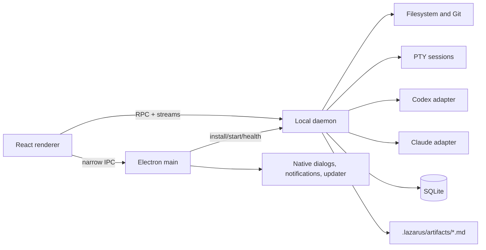
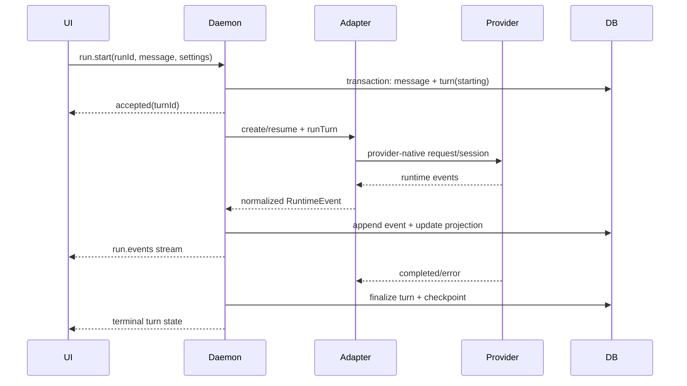
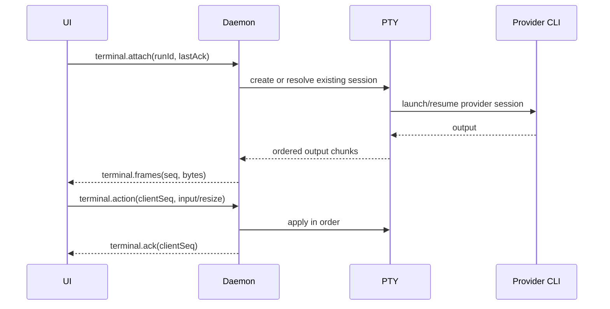

# Lazarus Technical Architecture

## Architectural choice

Lazarus uses three runtime processes:

1. **Renderer** — browser-safe React application.
2. **Desktop main** — Electron lifecycle and narrow native capabilities.
3. **Daemon** — local machine authority for files, Git, worktrees, PTYs, provider processes, persistence, and domain RPC.

The daemon is a separate executable supervised by Desktop. Electron main does not proxy normal domain RPC; the renderer connects directly to the daemon over authenticated localhost WebSocket after receiving a readiness snapshot.

## Why this boundary

- Provider CLIs and PTYs survive renderer reloads.
- A browser-safe renderer is easier to secure and test.
- Desktop stays replaceable by a later web client.
- Daemon crashes and upgrades are isolated from Electron.
- Domain protocol evolution does not expand privileged IPC.

The cost is lifecycle management and a second local transport. That cost is justified by the requested durable Chat and Terminal surfaces.

## System diagram



## Monorepo layout

```text
apps/
├─ desktop/              Electron main, preload, packaging
├─ renderer/             React application
└─ daemon/               local service executable
packages/
├─ protocol/             schemas, envelopes, generated client types
├─ client/               transport, reconnect, typed RPC client
├─ domain/               pure entities, transitions, policies
├─ provider-core/        normalized provider contract and events
├─ provider-codex/       Codex implementation
├─ provider-claude/      Claude implementation
└─ test-support/         process and transport fixtures only when reused
```

Do not split UI features into packages. Keep them inside `apps/renderer` until a second client actually reuses them.

## Technology choices

| Concern | Choice | Reason |
|---|---|---|
| Package/runtime | Bun workspaces | Fast scripts, TypeScript-first workflow, single tool |
| Task orchestration | Plain workspace scripts initially | Nx is unnecessary until builds become slow or graph-heavy |
| Desktop | Electron | Mature PTY/native/updater ecosystem and proven cross-platform packaging |
| UI | React + TypeScript + Vite | Browser-safe, productive component model |
| Server state | TanStack Query | Cache, cancellation, invalidation, mutation lifecycle |
| Client UI state | Zustand | Small explicit stores without server-state duplication |
| Routing | TanStack Router | Typed desktop memory routes and later browser compatibility |
| Styling | Tailwind + accessible primitives | Fast consistent UI without a custom component framework |
| Terminal | xterm.js | Standard browser terminal implementation |
| Local DB | SQLite through daemon | Durable transactions, indexes, migrations, inspection |
| Validation | Zod at every process/wire boundary | Runtime safety and schema-derived types |
| Transport | Local WebSocket | Unary and streaming traffic through one portable channel |
| Logging | Structured JSONL files | Simple support bundles and process correlation |

Native Node `child_process`, `fs`, and `crypto` remain inside daemon or Electron main. The renderer receives none of them.

## Runtime responsibilities

### Renderer

- Project/objective/run/artifact/diff UI.
- Query caching and optimistic presentation only where safe.
- Local ephemeral layout, tabs, drafts, and preferences.
- Typed daemon client.
- No path trust decisions, process execution, Git mutation, or secret storage.

### Electron main

- Single-instance/deep-link behavior.
- Window creation and state.
- Context-isolated preload bridge.
- Native folder/file pickers and external-open actions.
- Notifications, clipboard-native file paths, updater, crash handling.
- Daemon installation, process supervision, readiness, and diagnostics.
- OS credential storage only if Lazarus later stores its own secrets.

### Daemon

- Validate authenticated local connections.
- Resolve approved workspace roots and prevent path escape.
- Own project, objective, run, event, checkpoint, and worktree persistence.
- Spawn, resume, stop, and inspect provider sessions.
- Own PTYs and terminal action sequencing.
- Watch files and Git state.
- Read/write Markdown artifacts.
- Enforce permissions before executing tools or forwarding approval answers.
- Publish typed streams and recover after restart.

## Renderer architecture

```text
src/
├─ app/                  bootstrap, providers, router
├─ features/
│  ├─ projects/
│  ├─ objectives/
│  ├─ runs/
│  ├─ chat/
│  ├─ terminal/
│  ├─ artifacts/
│  ├─ changes/
│  ├─ files/
│  ├─ worktrees/
│  └─ settings/
├─ components/ui/        shared primitives
├─ client/               daemon client hooks and query keys
├─ stores/               client-only state
└─ lib/                  cross-feature browser-safe utilities
```

Rules:

- Daemon calls go through TanStack Query hooks.
- Query keys include daemon instance ID and project/run scope.
- Zustand never becomes a second daemon cache.
- Routes preload identity-critical data; effects handle streams and browser/native synchronization only.
- Feature actions are plain functions reused by menus, buttons, shortcuts, and the command palette.

## Local daemon lifecycle

### Installation

- Desktop ships a version-matched daemon executable as a packaged resource for v1.
- On launch, Desktop copies it into the per-user Lazarus application-data directory through a staged atomic replacement.
- The executable SHA-256 is embedded in Desktop build metadata and checked before activation.
- Public beta adds platform code signing and signed update manifests.

Shipping the daemon with Desktop is simpler than a separate registry for the first product. Split releases only when independent daemon updates become operationally necessary.

### Readiness contract

Daemon writes an atomic `runtime.json`:

```json
{
  "instanceId": "uuid",
  "pid": 1234,
  "port": 43127,
  "startedAt": "ISO-8601",
  "daemonVersion": "0.1.0",
  "protocolVersion": { "major": 1, "minor": 0 },
  "authNonceHash": "sha256"
}
```

Desktop:

1. validates file ownership/location and shape;
2. checks process identity, not PID alone;
3. probes `/health` on loopback;
4. gives the renderer the endpoint and one-time connection token through preload;
5. monitors process exit and runtime-file replacement.

### Connection authentication

- Desktop generates a random 256-bit boot secret.
- It passes the secret to the daemon through an inherited pipe or protected temporary file, never command-line arguments.
- The renderer receives a short-lived derived connection token through preload.
- The daemon accepts only loopback and validates the token during WebSocket open.
- Tokens are bound to daemon `instanceId` and expire quickly.

This prevents unrelated local web pages from controlling the daemon through localhost.

## Provider adapter contract

Chat and Terminal share lifecycle concepts but keep separate runtime methods.

```ts
interface ProviderAdapter {
  readonly id: "codex" | "claude";
  probe(): Promise<ProviderInstallation>;
  listModels(): Promise<readonly ModelDescriptor[]>;
  createChat(input: CreateChatInput): Promise<ProviderSession>;
  resumeChat(input: ResumeChatInput): Promise<ProviderSession>;
  runTurn(input: RunTurnInput, sink: RuntimeEventSink): Promise<TurnResult>;
  steerTurn(input: SteerTurnInput): Promise<SteerResult>;
  stopTurn(input: StopTurnInput): Promise<void>;
  launchTerminal(input: LaunchTerminalInput): Promise<TerminalLaunch>;
  resumeTerminal(input: ResumeTerminalInput): Promise<TerminalLaunch>;
  readTranscript(input: TranscriptInput): Promise<TranscriptResult>;
}
```

This is a behavior contract, not a lowest-common-denominator feature list. Capabilities are discovered explicitly:

```ts
interface ProviderCapabilities {
  chat: boolean;
  terminal: boolean;
  steering: boolean;
  nativeFork: boolean;
  structuredApprovals: boolean;
  modelDiscovery: boolean;
  transcriptRead: boolean;
}
```

Provider-specific session metadata is stored as a discriminated union. Do not reduce it to an opaque string because resume and diagnostics require different fields.

## Chat execution trace



Acceptance occurs only after the initial message and turn record commit. Every streamed event receives a monotonic sequence number per run before the UI sees it.

## Terminal execution trace



Terminal input uses client sequence numbers and acknowledgements so reconnect can distinguish applied from unapplied input. Scrollback is a bounded daemon-side ring buffer, not the durable transcript source.

## Worktree service

The daemon owns Git commands. Operations:

- list repository/worktrees/branches/status;
- create a branch and worktree;
- create from current branch;
- optionally carry dirty changes after explicit confirmation;
- bind execution location to a run;
- run project-defined setup/teardown scripts with visible output;
- delete only a verified managed worktree with clean-state checks.

Run bindings are immutable once a Terminal session starts. Chat runs may change execution location between turns, recorded as a new binding revision and checkpoint.

## Failure handling

| Failure | Behavior |
|---|---|
| Renderer reload | Reconnect, replay from last event sequence, reattach PTYs |
| Desktop main crash | Daemon continues; next launch validates and adopts it |
| Daemon crash | Provider child processes terminate as a process group where possible; run becomes interrupted and resumable |
| Provider CLI crash | Persist typed provider failure and retain session metadata |
| WebSocket drop before send | Retry after reconnect |
| Drop after mutation send | Reconcile by request ID; do not blindly retry |
| Database busy | Serialize daemon writes; bounded wait and explicit failure |
| Artifact edited externally | Watch, re-read, validate frontmatter, show conflict only when an unsaved editor draft exists |
| Workspace missing | Keep project metadata; mark unavailable; allow relink |
| Worktree setup failure | Preserve worktree and logs; offer retry or explicit cleanup |

## Deferred extension seams

- Later web client: reuse renderer, protocol, and client packages.
- Later cloud sync: daemon replicates domain events/checkpoints; local DB remains source during disconnect.
- Later collaboration: introduce document-room service for artifact bodies only after multi-writer need.
- Later remote daemon: replace direct local transport with an authenticated encrypted transport implementing the same client interfaces.

No cloud client, CRDT interface, relay abstraction, or remote-host registry is created in v1.

