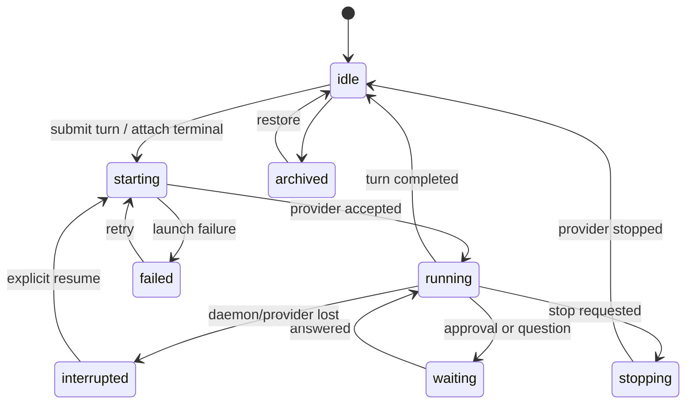

# Lazarus Data and Protocol Plan

## Storage strategy

Use two deliberately different stores:

1. **SQLite** in the daemon application-data directory for operational state, sessions, events, checkpoints, settings, and indexes.
2. **Markdown files** under each project for user-owned artifacts.

Do not store run history as ad hoc JSON files and do not put binary operational data into the project repository.

## SQLite location

```text
<user-data>/lazarus/
├─ daemon/
│  ├─ runtime.json
│  ├─ daemon.log.jsonl
│  └─ lazarus.sqlite3
├─ diagnostics/
└─ temp/
```

Use WAL mode, foreign keys, explicit transactions, and schema migrations. The daemon is the only database writer.

## Core relational model

### `projects`

| Column | Meaning |
|---|---|
| `id` | Stable UUID |
| `title` | User-facing name |
| `created_at`, `updated_at` | Timestamps |
| `archived_at` | Nullable archive marker |
| `last_opened_at` | Home ordering |

### `workspace_roots`

| Column | Meaning |
|---|---|
| `id`, `project_id` | Identity/owner |
| `canonical_path` | Daemon-resolved absolute path |
| `display_path` | User-facing path |
| `repo_identity` | Stable Git identity when available |
| `unavailable_at` | Nullable reachability marker |

### `objectives`

| Column | Meaning |
|---|---|
| `id`, `project_id` | Identity/owner |
| `title`, `summary` | Intent |
| `status` | active, completed, archived |
| `created_at`, `updated_at` | Timestamps |

### `execution_locations`

| Column | Meaning |
|---|---|
| `id`, `workspace_root_id` | Identity/owner |
| `kind` | local or worktree |
| `canonical_path` | Resolved location |
| `branch`, `head_sha` | Git snapshot metadata |
| `managed` | Lazarus created it |
| `created_at`, `deleted_at` | Lifecycle |

### `runs`

| Column | Meaning |
|---|---|
| `id`, `objective_id` | Identity/owner |
| `surface` | chat or terminal |
| `provider_id` | codex or claude |
| `title` | User-facing title |
| `state` | durable run state |
| `execution_location_id` | Current/fixed binding |
| `permission_mode` | supervised or trusted-workspace |
| `model`, `reasoning_effort` | Nullable provider settings |
| `provider_session` | Validated provider-specific JSON |
| `created_at`, `updated_at`, `archived_at` | Lifecycle |

### `turns`

| Column | Meaning |
|---|---|
| `id`, `run_id` | Identity/owner |
| `client_request_id` | Idempotency/reconciliation key |
| `state` | accepted, running, waiting, completed, stopped, failed, interrupted |
| `input_json` | Validated submitted content |
| `started_at`, `finished_at` | Lifecycle |
| `error_code`, `error_message` | Nullable failure |

### `run_events`

| Column | Meaning |
|---|---|
| `run_id`, `seq` | Composite ordered key |
| `turn_id` | Nullable turn link |
| `kind` | Event discriminator |
| `payload_json` | Versioned event payload |
| `created_at` | Timestamp |

Events are append-only. Mutable UI projections are derived and may be cached, but the event log remains the recovery authority for Chat history.

### `checkpoints`

Records run state, provider session identity, execution-location revision, Git HEAD, dirty fingerprint, and last event sequence after meaningful boundaries.

### `approvals`

Stores request, risk kind, status, answer, and timestamps. Pending approval state survives renderer reload. Provider ephemeral handles remain in memory and are failed as interrupted if the daemon restarts.

### `terminal_sessions`

Stores run link, daemon attachment state, rows/columns, process identity, last input acknowledgement, and bounded scrollback metadata. Never claim terminal scrollback is the durable provider transcript.

## Run state machine



Terminal runs use the same durable states, but `running` may mean the PTY/provider process is alive without an active model turn.

## Normalized runtime events

Start with the events required by the actual UI:

- `turn.started`
- `text.delta`, `text.completed`
- `reasoning.delta`, `reasoning.completed`
- `tool.started`, `tool.progress`, `tool.completed`, `tool.failed`
- `command.started`, `command.completed`
- `file.changed`
- `approval.requested`, `approval.resolved`
- `question.requested`, `question.resolved`
- `plan.updated`
- `usage.updated`
- `provider.notice`
- `turn.completed`, `turn.stopped`, `turn.failed`

Unknown provider events are retained as `provider.raw` only in developer builds and logs, not promoted into permanent product contracts until a UI or recovery need exists.

## Artifact format

Project layout:

```text
<project>/.lazarus/
├─ artifacts/
│  ├─ api-redesign-spec.md
│  └─ auth-review.md
└─ project.json
```

Example artifact:

```md
---
id: 018f...
type: spec
title: API redesign
objectiveIds:
  - 018e...
runIds: []
status: active
createdAt: 2026-08-04T10:00:00Z
updatedAt: 2026-08-04T10:00:00Z
---

# API redesign

...
```

Rules:

- The path is not identity; frontmatter `id` is.
- Unknown frontmatter keys are preserved on rewrite.
- Body is ordinary UTF-8 Markdown.
- Atomic save uses temp file plus rename in the same directory.
- External edits win unless Lazarus has an unsaved local draft; then show a three-way choice rather than silently merging.
- `.lazarus/` may be committed or ignored by the user.

## Protocol layering

```text
WebSocket
└─ connection open / openAck
   ├─ unary request / response
   └─ subscribe / stream frame / close
```

All frames include a protocol version and are validated by Zod on both sides.

### Connection open

Client sends:

- protocol `{major, minor}`;
- daemon instance ID expectation;
- short-lived connection token;
- renderer version;
- supported capabilities.

Daemon replies with:

- accepted protocol version;
- daemon/version identity;
- supported capabilities;
- server time;
- connection ID.

v1 uses one protocol version for the whole connection. Per-method versioning is deferred until client and daemon need independent release cadence.

### Unary envelope

```ts
type RequestFrame = {
  type: "request";
  requestId: string;
  method: string;
  params: unknown;
};

type ResponseFrame = {
  type: "response";
  requestId: string;
  result?: unknown;
  error?: { code: string; message: string; retryable: boolean };
};
```

### Stream envelope

```ts
type SubscribeFrame = {
  type: "subscribe";
  streamId: string;
  method: string;
  params: unknown;
  afterSeq?: number;
};

type StreamFrame = {
  type: "stream";
  streamId: string;
  seq: number;
  payload: unknown;
};
```

Binary terminal frames use WebSocket binary messages with a small fixed header carrying stream ID, sequence, and payload kind. Do not base64 terminal data.

## Initial method surface

### Projects/workspaces

- `project.list`, `project.open`, `project.create`, `project.update`
- `workspace.pickResult.register`, `workspace.status`, `workspace.fileTree`, `workspace.readFile`

### Objectives/runs

- `objective.list`, `objective.create`, `objective.update`, `objective.archive`
- `run.list`, `run.get`, `run.create`, `run.update`, `run.archive`
- `turn.start`, `turn.stop`, `turn.answerApproval`, `turn.answerQuestion`
- `run.events.subscribe`

### Providers

- `provider.list`, `provider.probe`, `provider.models`, `provider.configurePath`

### Terminal

- `terminal.attach`, `terminal.detach`, `terminal.action`, `terminal.frames.subscribe`

### Artifacts/files/git/worktrees

- `artifact.list`, `artifact.read`, `artifact.write`, `artifact.delete`, `artifact.events.subscribe`
- `git.status`, `git.diff`, `git.status.subscribe`
- `worktree.list`, `worktree.create`, `worktree.delete`, `worktree.setup.subscribe`

Keep this list small. Add a method when a real UI flow requires it.

## Mutation reconciliation

Every mutation carries a client-generated `requestId`. The daemon stores completed mutation outcomes for a bounded window. After an ambiguous disconnect, the client asks `request.outcome(requestId)` before retrying.

Safe automatic retry categories:

- connection never opened;
- request frame was never queued;
- daemon explicitly says it did not dispatch;
- read-only/idempotent query.

Everything else requires reconciliation or explicit user retry.

## Migration policy

### Database

- Monotonic integer schema version.
- One transactional migration per released version.
- Before migration, copy the database through SQLite backup API.
- On failure, restore the backup and keep the older daemon available.
- Never make a destructive migration irreversible in the same release that first introduces it.

### Protocol

- Same major: additive optional fields only.
- Major bump: explicit connection rejection with upgrade guidance.
- Keep current and previous major compatibility only after independent client/daemon releases exist.

### Artifacts

- Frontmatter `formatVersion` begins at 1.
- Readers preserve unknown fields.
- New optional fields do not require migration.
- Breaking changes use a new version and an explicit file rewrite command with preview.

## Data acceptance tests

1. Kill the daemon after acknowledging a message but before provider launch; restart shows an interrupted resumable turn, not data loss.
2. Replay the same mutation request ID; the result is returned without duplicate effects.
3. Edit an artifact externally while no local draft exists; UI updates.
4. Edit externally while a local draft exists; UI asks rather than overwrites.
5. Reconnect a Chat stream from sequence N; every later event arrives once and in order.
6. Reconnect a Terminal stream; acknowledged input is never resent.
7. Run database migration failure injection; old version remains launchable.

