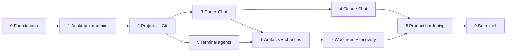

# Lazarus Delivery Roadmap

## Delivery strategy

Build vertical slices that end in observable user capability. Infrastructure is introduced only when the next slice needs it. Every milestone has an acceptance gate; work does not proceed merely because files exist.

Estimated schedule assumes two experienced full-time engineers. One engineer should expect roughly double the calendar duration. Estimates are planning ranges, not commitments.

## Dependency map

## Milestone 0 — Foundations

**Goal:** A buildable repository with settled contracts and quality gates.

**Range:** 1 week.

Deliverables:

- Bun workspace and package boundaries from `ARCHITECTURE.md`.
- TypeScript, lint, format, unit-test, and CI setup.
- Architectural decision records for process boundary, storage, protocol, and providers.
- Shared error vocabulary and logging policy.
- UX prototype for Home, Objective, Chat, Terminal, and Changes.
- Threat model for renderer, local transport, paths, and process execution.

Acceptance gate:

- All packages build from a clean checkout.
- CI runs compile, lint, tests, dependency audit, and secret scan.
- No unresolved load-bearing decisions remain for Milestone 1.
- Five core screens have keyboard-flow prototypes reviewed against `UX-UI.md`.

## Milestone 1 — Desktop and daemon spine

**Goal:** Secure renderer↔daemon connectivity and durable lifecycle.

**Range:** 2 weeks.

Deliverables:

- Electron main/preload/renderer shell.
- Packaged local daemon executable.
- Staged daemon install/adoption and single-instance behavior.
- `runtime.json`, health probe, boot secret, short-lived renderer token.
- WebSocket open/openAck, typed request/response, typed stream transport.
- Structured logs and Diagnostics screen skeleton.
- Renderer query client connected to daemon health/status.

Acceptance gate:

- Renderer cannot access Node or arbitrary IPC.
- Fresh install starts daemon and connects.
- Renderer reload reconnects without daemon restart.
- Desktop restart adopts an existing healthy daemon.
- Wrong token/origin/instance connections are rejected.
- Failed daemon readiness shows a useful recovery surface and log tail.

## Milestone 2 — Projects, files, and Git inspection

**Goal:** Open a real repository and inspect it safely.

**Range:** 2 weeks.

Deliverables:

- SQLite schema/migrations for projects and workspace roots.
- Native folder picker and project onboarding.
- Canonical root/path authorization.
- Recent projects and unavailable/relink behavior.
- File tree and text/image preview.
- Git repository, branch, status, and diff reads.
- File/Git watcher streams with coalescing.

Acceptance gate:

- Opening a repository survives restart.
- Traversal and symlink-escape tests pass.
- A dirty repository renders exact status and diff.
- External file changes update UI without refresh.
- Missing project folder is preserved as unavailable and can be relinked.

## Milestone 3 — Codex structured Chat vertical slice

**Goal:** Complete the core value loop with one provider.

**Range:** 3 weeks.

Deliverables:

- Objectives, runs, turns, run events, checkpoints schema.
- Codex installation/login/model probe.
- Codex provider adapter for create/resume/run/stop.
- Normalized Chat event stream.
- Chat transcript, typed tool cards, composer, and run state.
- Durable message acceptance and restart recovery.
- Basic supervised approvals.
- Changed-file cards linked to Git diff.

Acceptance gate:

- User completes ten representative Codex tasks.
- Runs resume after full Desktop and daemon restart.
- Killing the daemon during a turn yields interrupted/resumable state without duplicate messages.
- Ambiguous mutation disconnect does not duplicate a turn.
- Tool, approval, error, and completion events render from persisted replay.

## Milestone 4 — Claude structured Chat

**Goal:** Prove the provider boundary with a genuinely different runtime.

**Range:** 2 weeks.

Deliverables:

- Claude Code installation/login/model probe.
- Claude provider session create/resume/run/steer/stop.
- Mapping from Claude-native events and approvals into normalized events.
- Capability-driven composer controls.
- Provider-specific diagnostics and failure copy.
- Cross-provider run creation under one objective.

Acceptance gate:

- Shared Chat UI contains no Claude/Codex branching outside provider-aware labels/capabilities.
- Claude and Codex each pass the same core behavioral contract suite.
- Unsupported capabilities are hidden/disabled from discovered capability data.
- Provider-native session IDs resume correctly.

## Milestone 5 — Terminal agents

**Goal:** Durable provider-native PTY sessions for Codex and Claude.

**Range:** 3 weeks; can begin after Milestone 2 in parallel with Chat work.

Deliverables:

- PTY manager and process-group lifecycle.
- Terminal protocol with binary output, action sequence, acknowledgements, and reconnect.
- xterm renderer surface with resize/search/copy/paste.
- Codex and Claude Terminal launch/resume commands.
- Terminal-run persistence and provider transcript metadata.
- Bounded scrollback/snapshot recovery.
- Sleep/wake and renderer-reload recovery.

Acceptance gate:

- Input is neither lost nor duplicated across renderer reconnect.
- Terminal resizes correctly on all target OSes.
- Closing a tab does not delete the durable run.
- Daemon restart makes the run interrupted and explicitly resumable.
- Process cleanup leaves no orphan test processes.

## Milestone 6 — Artifacts, timeline, and change inspection

**Goal:** Preserve intent and connect activity to resulting code.

**Range:** 2 weeks.

Deliverables:

- `.lazarus/artifacts/` Markdown format and watcher.
- Artifact notebook/editor/preview.
- Objective timeline aggregating run events, checkpoints, and changes.
- Inspector split for exact file/diff links.
- Change attribution when a provider supplies path/tool correlation.
- External editor open action.

Acceptance gate:

- Markdown files round-trip without losing unknown metadata.
- External edits update safely; concurrent unsaved draft produces a choice.
- Tool/file-change cards open correct project/location/path.
- Objective timeline reconstructs from persisted data after restart.

## Milestone 7 — Worktrees and recovery hardening

**Goal:** Safe isolated execution and robust failure recovery.

**Range:** 3 weeks.

Deliverables:

- List/create/select/delete worktrees.
- Optional carry-uncommitted-changes workflow.
- Project setup/teardown scripts and visible logs.
- Immutable Terminal binding and versioned Chat binding.
- Startup reconciliation for runs, PTYs, worktrees, and interrupted mutations.
- Database backup/rollback migration path.
- Fault-injection test suite.

Acceptance gate:

- Managed worktree creation and deletion pass cross-platform tests.
- Dirty/unmanaged/broad targets cannot be deleted.
- Setup failure preserves diagnosable state.
- Crash at each lifecycle checkpoint converges to a truthful recoverable state.
- Previous application version can reopen a restored pre-migration backup.

## Milestone 8 — Product hardening

**Goal:** Turn the working system into a coherent private alpha.

**Range:** 3 weeks.

Deliverables:

- Complete onboarding, settings, command palette, shortcuts, and empty/error states.
- Accessibility and zoom pass.
- Performance profiling and virtualization for long transcripts/file trees.
- Scrubbed diagnostics export and runbooks.
- Update staging/rollback.
- Project import/export metadata where needed.
- Documentation and provider support matrix.

Acceptance gate:

- First run to first agent turn under five minutes in usability tests.
- Keyboard-only core flows pass.
- 200% zoom and reduced-motion flows pass.
- 100k-event synthetic run remains interactive.
- Diagnostics bundle contains no seeded sensitive corpus values.

## Milestone 9 — Public beta and v1

**Goal:** Ship reliable cross-platform installations with stable local data.

**Range:** 3–5 weeks depending on signing/platform issues.

Deliverables:

- macOS notarized arm64/x64 builds.
- Windows signed x64 installer.
- Linux AppImage/deb package.
- Signed update feeds and staged rollout.
- Crash reporting as explicit opt-in.
- Migration compatibility policy and support window.
- Security review and dependency audit.
- Recovery documentation and issue-report template.

Acceptance gate:

- Clean-machine install/update/uninstall matrix passes.
- Upgrade from every beta data version passes.
- Rollback from failed daemon readiness passes.
- No critical/high security findings remain.
- v1 definition in `README.md` passes on all supported OSes.

## Release sequencing

| Release | Included milestones | Audience |
|---|---|---|
| Preview 0 | 0–2 | Development team |
| Preview 1 | 3 | Codex-focused design partners |
| Alpha | 0–7 | Invited Codex/Claude users |
| Beta | 0–8 | Public testers |
| v1 | 0–9 | General availability |

## Parallel work boundaries

Safe parallel lanes after Milestone 1:

- Chat provider integration and Terminal PTY work.
- UI visual system and daemon domain implementation.
- Packaging matrix and feature development after daemon install is stable.

Do not parallelize competing implementations of the provider contract, protocol envelopes, database writer, or permission model.

## Exit decision after each milestone

At each gate ask:

1. Did the user capability work end to end?
2. Did we create abstractions not exercised by that capability?
3. What failure was hardest to explain?
4. Which next milestone assumption was disproved?
5. Should scope be deleted before more code is added?

